<div align="center">

# 🧠 Sachin Rawal — AI & Machine Learning Portfolio

<p align="center">
  <strong>An interactive, high-performance 3D portfolio translating machine learning workflows into cinematic WebGL architectures.</strong>
</p>

<p align="center">
  <a href="https://github.com/Sachin-Rawal091/Who-am-I-">
    
  </a>
  <a href="https://github.com/Sachin-Rawal091/Who-am-I-">
    
  </a>
  <a href="https://github.com/Sachin-Rawal091/Who-am-I-">
    
  </a>
  <a href="https://github.com/Sachin-Rawal091/Who-am-I-">
    
  </a>
  <a href="https://github.com/Sachin-Rawal091/Who-am-I-">
    
  </a>
  <a href="https://github.com/Sachin-Rawal091/Who-am-I-">
    
  </a>
</p>

<p align="center">
  <a href="#-key-features"><strong>Explore Features</strong></a> •
  <a href="#-3d-pipeline-architecture"><strong>3D Architecture</strong></a> •
  <a href="#-quick-start"><strong>Quick Start</strong></a> •
  <a href="#-tech-stack"><strong>Tech Stack</strong></a> •
  <a href="#-performance--benchmarks"><strong>Benchmarks</strong></a> •
  <a href="#-connect"><strong>Connect</strong></a>
</p>

---

</div>

## 🌌 Overview

> *"I train intelligence — then code it into working software."*

This repository houses the personal portfolio of **Sachin Rawal**, an **AI & Machine Learning Engineer and Web Developer**. Built from the ground up as a computational showpiece, the website turns the standard portfolio layout into a live, scroll-driven Machine Learning pipeline:

- **Data Ingestion** $\rightarrow$ **Feature Extraction** $\rightarrow$ **Model Training** $\rightarrow$ **Inference** $\rightarrow$ **Deployment**

The 3D neural core reacts physically in real-time to scroll progress, mouse physics, and user gestures, dynamically morphing across mathematical topologies at a locked 60 FPS.

---

## ✨ Key Features

### 🧠 1. Persistent 3D Neural Architecture
- **48-Node Fibonacci Core**: Procedurally generated nodes mapped with dynamic lighting, metallic roughness, and idle float oscillations.
- **Draw Call Batching (80 $\rightarrow$ 1 Draw Call)**: Replaces traditional individual line components with a single `THREE.LineSegments` buffer geometry mutated in `useFrame`.
- **Interactive Wireframe Glows**: Hovering over skill cards activates targeted 3D glowing auras and particle bursts around corresponding neural clusters.
- **Physics-Damped Inspection**: Left-click-and-drag lets visitors inspect the neural structure with smooth `expo.out` rotational dampening.

### ⚡ 2. "RUN PIPELINE" Cinematic Guided Tour
- **Automated Stage Traversal**: One click launches an orchestrated Lenis smooth-scroll journey traversing all 5 pipeline stages.
- **Floating Futuristic HUD**: Displays current stage metrics, progress percentage, pulsing status indicators, and an animated progress bar.
- **Intuitive Cancellation**: Visitors can seamlessly break out of the tour at any instant using the mouse wheel, touch swipe, or `Escape` key.

### 📈 3. Scroll-Driven D3 Loss Convergence Telemetry
- **Dynamic Training Loss Curves**: Renders an interactive D3 SVG loss curve synchronized with the visitor's scroll position.
- **Live Metric Readouts**: Displays Epoch progression (1 to 50), accuracy (98.4%), and real-time convergence states.

### 🃏 4. 3D Perspective Card Carousel
- **Spatial Inference Showcase**: Shipped projects presented on a 3D perspective stage with swipe gesture physics, keyboard arrow navigation, and real-time pipeline diagrams.

### 🔋 5. Adaptive Performance & GPU Sleep
- **Tab Visibility Sleep Hook**: Automatically pauses the R3F frame loop (`frameloop="never"`) when the visitor switches browser tabs to eliminate battery and GPU drain.
- **Dynamic DPR Capping**: Tailored resolution scaling for low-power mobile devices prevents thermal throttling on high-density OLED screens.
- **Zero-Allocation Cache**: Uses `STAGE_POS_CACHE` vector pooling to eliminate 70,000+ GC object allocations per second.

### 📨 6. Direct Message Transmission (EmailJS)
- **Built-in Contact Terminal**: Integrated EmailJS transmission payload with auto-fallback to direct email clients and live `aria-live` screen-reader feedback.

---

## 🏗️ 3D Pipeline Architecture

```mermaid
graph LR
    A["Stage 00<br/><b>System Boot</b><br/><i>Fibonacci Core</i>"] --> B["Stage 01<br/><b>Data Ingestion</b><br/><i>Ingestion Funnel</i>"]
    B --> C["Stage 02<br/><b>Feature Extraction</b><br/><i>Layer Columns</i>"]
    C --> D["Stage 03<br/><b>Model Training</b><br/><i>Double Helix</i>"]
    D --> E["Stage 04<br/><b>Inference Output</b><br/><i>Output Rays</i>"]
    E --> F["Stage 05<br/><b>Deployment</b><br/><i>Concentric Ring</i>"]

    style A fill:#12161d,stroke:#f2914b,stroke-width:2px,color:#edeff2
    style B fill:#12161d,stroke:#38bdf8,stroke-width:2px,color:#edeff2
    style C fill:#12161d,stroke:#f2914b,stroke-width:2px,color:#edeff2
    style D fill:#12161d,stroke:#a855f7,stroke-width:2px,color:#edeff2
    style E fill:#12161d,stroke:#38bdf8,stroke-width:2px,color:#edeff2
    style F fill:#12161d,stroke:#f2914b,stroke-width:2px,color:#edeff2
```



| Stage | Section | 3D Topology | Narrative Meaning |
| :--- | :--- | :--- | :--- |
| **00** | **Hero / Boot** | *Fibonacci Sphere* | Uninitialized raw neural weights |
| **01** | **About** | *Funnel / Data Flow* | Ingesting education, credentials & background data |
| **02** | **Skills** | *Layered Columns* | Feature mapping (ML Core, Web Stack, Tooling) |
| **03** | **Training** | *Double Helix* | Model training & loss convergence tracking |
| **04** | **Projects** | *Output Rays* | Shipped inference outputs & full-stack apps |
| **05** | **Contact** | *Concentric Ring* | Production deployment & client contact |

---

## 🛠️ Tech Stack

<div align="center">

| Layer | Technologies |
| :--- | :--- |
| **Core Framework** | `React 19` • `Vite 8` • `JavaScript (ESNext)` |
| **3D & WebGL Engine** | `Three.js` • `@react-three/fiber` • `@react-three/drei` |
| **Choreography & Motion** | `GSAP` • `ScrollTrigger` • `Lenis Smooth Scroll` • `Framer Motion` |
| **Data Visualization** | `D3.js` |
| **Styling & Design System** | `Tailwind CSS v4` • Self-hosted Variable Fonts (`Space Grotesk`, `Inter`, `JetBrains Mono`) |
| **Communication & Services** | `@emailjs/browser` |
| **Code Quality & Linter** | `Oxlint` (12ms validation) |

</div>

---

## 📁 Project Structure

```bash
Portfolio/
├── .env.example              # Template for EmailJS environment variables
├── .gitignore                # Professional multi-tier ignore configuration
├── index.html                # Semantic entrypoint with JSON-LD schema & noscript
├── package.json              # Dependencies and build scripts
├── vite.config.js            # Vite configuration with Tailwind CSS plugin
│
├── public/
│   ├── favicon.svg           # Custom vector favicon
│   ├── og-image.png          # Social preview OpenGraph banner
│   └── resume.pdf            # Downloadable curriculum vitae
│
└── src/
    ├── App.jsx               # Root shell uniting 3D Canvas, HUD, & scroll layout
    ├── main.jsx              # React 19 application entrypoint
    │
    ├── components/
    │   ├── boot/             # System intro & hero telemetry
    │   ├── layout/           # SmoothScroll (Lenis context provider)
    │   ├── sections/         # About, Skills, Training, Projects, Contact, Footer
    │   └── ui/               # GlassPanel, DeployButton, DragIndicator, PipelineHUD
    │
    ├── data/                 # Pure data layer (identity, skills, projects, trainingRun)
    ├── hooks/                # usePipelineScroll (staged tour orchestrator)
    ├── lib/                  # LenisContext, motion constants & hardware diagnostics
    ├── styles/               # index.css (Tailwind v4 tokens, glass classes, keyframes)
    │
    └── three/                # 3D Scene Graph
        ├── AIWorld.jsx       # Lighting, group rotation physics & context loss handlers
        ├── HeroCanvas.jsx    # Canvas mount, DPR scaling & tab visibility sleep
        ├── NeuralNodes.jsx   # Instanced 48-node mesh & reactive neon glow auras
        ├── NeuralConnections.jsx # Single-draw-call line segments buffer
        ├── DataParticles.jsx # Ambient particle dust & trigger bursts
        ├── ScrollCamera.jsx  # GSAP ScrollTrigger camera dolly
        └── machineData.js    # Geometric topologies & zero-allocation STAGE_POS_CACHE
```

---

## 🚀 Quick Start

### Prerequisites
- Node.js (v18.0.0 or higher recommended)
- npm, pnpm, or yarn

### 1. Clone Repository
```bash
git clone https://github.com/Sachin-Rawal091/Who-am-I-.git
cd Who-am-I-
```

### 2. Install Dependencies
```bash
npm install
```

### 3. Configure Environment Variables
Copy `.env.example` to `.env` and add your [EmailJS](https://www.emailjs.com/) credentials:
```bash
cp .env.example .env
```
```env
VITE_EMAILJS_SERVICE_ID=your_service_id
VITE_EMAILJS_TEMPLATE_ID=your_template_id
VITE_EMAILJS_PUBLIC_KEY=your_public_key
```
*(Note: If keys are omitted, the contact form automatically falls back to native `mailto:` links!)*

### 4. Run Locally
```bash
npm run dev
```
Open **`http://localhost:5173`** in your browser.

### 5. Production Build
```bash
npm run build
npm run preview
```

---

## 📊 Performance & Benchmarks

| Metric | Target / Benchmark | Result |
| :--- | :--- | :--- |
| **Framerate** | 60 FPS (Desktop & Mobile) | **Locked 60 FPS** |
| **Neural Line Draw Calls** | $\le 5$ draw calls | **1 Draw Call** (`LineSegments`) |
| **Frame GC Allocations** | Zero Vector3 thrashing | **0 allocs/sec** (`STAGE_POS_CACHE`) |
| **Background GPU Usage** | 0% when tab is hidden | **Fully Paused** (`frameloop="never"`) |
| **Linter (`oxlint`)** | 0 warnings, 0 errors | **0 warnings / 0 errors (12ms)** |
| **Vite Build Time** | $< 1.0\text{s}$ | **~388ms** |
| **WCAG Accessibility** | Contrast ratio $\ge 4.5:1$ | **Passed ($\ge 6.2:1$)** |

---

## 🤝 Connect & Hire

Sachin Rawal is available for **AI/ML Engineering roles, Web Development contracts, and Internships**.

- 📧 **Email**: [sachinrawal473@gmail.com](mailto:sachinrawal473@gmail.com)
- 💼 **LinkedIn**: [linkedin.com/in/sachin-rawal-5a33ab247](https://linkedin.com/in/sachin-rawal-5a33ab247)
- 🐙 **GitHub**: [@Sachin-Rawal091](https://github.com/Sachin-Rawal091)
- 📍 **Location**: Jaipur, Rajasthan, India

---

<div align="center">

### ⭐ Support this Project
If you find this 3D portfolio architecture inspiring, please give this repository a **Star**!

<sub>Designed & Engineered with craft by **Sachin Rawal** · © 2026</sub>

</div>
